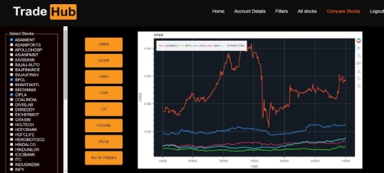

<h1>Introduction</h1>

This project report details the development and assessment of a trading simulator and analyzer, with a specific focus on real historical data pertaining to NIFTY-50 stocks. The project is structured into three sub-tasks, with the primary objective of collect- ing, transforming, and analysing financial data. By leveraging the jugaad-data Python library, we extract valuable insights by performing trend analysis on real data.

<h1>TradeHub</h1>

The web development project focuses on creating a dynamic and user-friendly platform for retrieving historical data of stocks listed in Nifty50. The primary functionality in- cludes the ability to fetch and display live stock values on a graph, providing users with real-time insights. Moreover, the platform allows users to compare the historical perfor- mance of different stocks by implementing customizable parameters. Additionally, users can filter stocks based on a set of specified criteria, enhancing the platform’s versatility and catering to individual preferences. The project aims to provide a comprehensive tool for investors and financial enthusiasts, offering a seamless experience for analyzing and visualizing stock data.![ref1]

<h1>Sign Up</h1>

The signup procedure in the web development project involves the collection of essential personal details, such as date of birth, name, chosen username, and password. This information is securely stored within a Flask server database. The utilization of Flask, a micro web framework for Python, ensures a reliable backend infrastructure. By stor- ing user data in a database, the project follows standard data management practices, facilitating secure and organized storage of user credentials.

<h1>Dashboard</h1>

Upon successful login, users are directed to the dashboard page, serving as the central hub of the web application. The dashboard features real-time news data sourced from the web, offering users immediate access to relevant information. Additionally, the page provides intuitive links to other key functionalities within the web app, streamlining navigation and ensuring a user-friendly experience. This centralized approach aims to enhance user engagement and efficiency by consolidating critical features in a single, easily accessible location.

<h1>All Stocks</h1>

The ”All Stocks” link on the dashboard directs users to a central webpage designed for in-depth analysis of individual stocks. This page provides live price updates and comprehensive historical data, including open, close, market capitalization, P/E ratio,![ref1] and more. Users can customize the graph plotting timeframe, ranging from 20 years to 1 day, allowing for a detailed examination of the stock’s performance over different periods. The presence of a left scrollbar simplifies navigation, enabling users to easily select and redirect to specific stock data of interest. This design enhances user accessibility and fosters a seamless exploration of diverse stocks within the web application.

<h1>Compare Stocks</h1>

The ”Compare Stocks” option from the dashboard leads users to a webpage dedicated to stock comparison. Initially, users select a parameter for comparison. Upon reloading the page in the chosen parameter mode, users can then select specific stocks for comparison using a checkboxed list in the left scrollbar. Additionally, users can specify the timeframe between which the data should be compared. Upon submitting these criteria, the page reloads, presenting comprehensive comparison plots. This interactive feature empowers users to make informed decisions by visually assessing the performance of selected stocks based on chosen parameters and timeframes within the web application.

<h1>Filter Stocks</h1>

The ”Filter Stocks” option on the dashboard directs users to a dedicated webpage hous- ing information from the Nifty50 stocks database, including Open, 52 Wk High, 52 Wk Low, LTP, Market Capital, and PE Ratio. Here, users have the capability to set minimum and maximum values for these parameters. Upon submission, the webpage dynamically filters the stocks based on the specified criteria, and the resulting dataset, meeting the user-defined conditions, is then displayed on the screen. This functionality provides users with a powerful tool to narrow down and focus on stocks that align with their specific criteria within the web application.![ref1]

[ref1]: Images/Aspose.Words.f95a8d61-bae0-447d-add3-4be395595d6b.003.png
